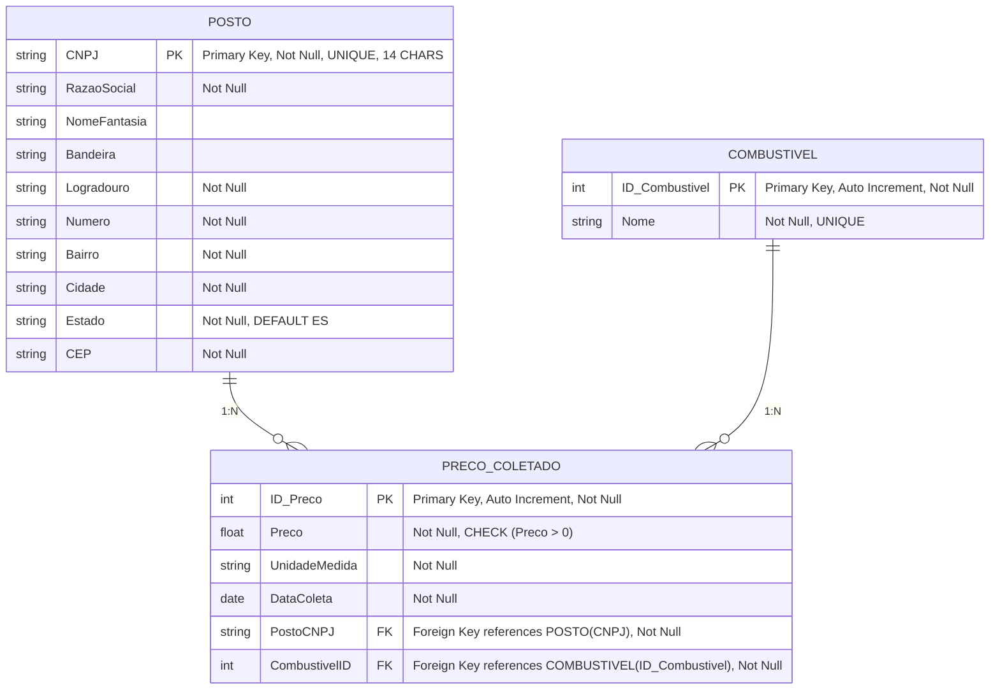

Arquitetura de Dados Relacionais I - AOP2 - Projeto lógico e físico 
=========================================

Introdução
----------

Este projeto visa criar um banco de dados relacional para armazenar e fornecer informações sobre os preços dos combustíveis na região. O objetivo é permitir a coleta, armazenamento e consulta de dados de preços de combustíveis em diferentes postos, bairros e datas, atendendo aos requisitos estabelecidos na AOP2.

Objetivos do Projeto
--------------------

-   Modelar um banco de dados em 3ª Forma Normal que armazene informações sobre combustíveis, postos e preços coletados.
-   Implementar o projeto lógico e físico utilizando o SGBD SQL Server.
-   Criar stored procedures que permitam consultas específicas exigidas pelo projeto.
-   Criar índices para otimizar o desempenho das consultas.
-   Fornecer instruções claras para a execução e uso do banco de dados.

Projeto Conceitual
------------------




Projeto Lógico e Físico
-----------------------

O projeto conceitual foi convertido em um modelo lógico e físico, resultando nas seguintes tabelas:

### Tabelas Criadas

1.  **COMBUSTIVEL**

    -   **ID_Combustivel** (INT, PRIMARY KEY, IDENTITY)
    -   **Nome** (VARCHAR(100), NOT NULL, UNIQUE)
2.  **POSTO**

    -   **ID_Posto** (INT, PRIMARY KEY, IDENTITY)
    -   **CNPJ** (VARCHAR(14), NOT NULL, UNIQUE, CHECK)
    -   **RazaoSocial** (VARCHAR(255), NOT NULL)
    -   **NomeFantasia** (VARCHAR(255))
    -   **Bandeira** (VARCHAR(100))
    -   **Logradouro** (VARCHAR(255), NOT NULL)
    -   **Numero** (VARCHAR(20), NOT NULL)
    -   **Bairro** (VARCHAR(100), NOT NULL)
    -   **Cidade** (VARCHAR(100), NOT NULL)
    -   **Estado** (VARCHAR(50), NOT NULL)
    -   **CEP** (VARCHAR(10), NOT NULL)
3.  **PRECO_COLETADO**

    -   **ID_Preco** (INT, PRIMARY KEY, IDENTITY)
    -   **Preco** (DECIMAL(10, 3), NOT NULL, CHECK)
    -   **UnidadeMedida** (VARCHAR(10), NOT NULL)
    -   **DataColeta** (DATE, NOT NULL)
    -   **CombustivelID** (INT, NOT NULL, FOREIGN KEY)
    -   **PostoID** (INT, NOT NULL, FOREIGN KEY)

### Índices Criados

-   **IDX_Posto_Bairro**: Índice na coluna `Bairro` da tabela `POSTO`.
-   **idx_precocoletado_combustivelid**: Índice na coluna `CombustivelID` da tabela `PRECO_COLETADO`.
-   **idx_precocoletado_datacoleta**: Índice na coluna `DataColeta` da tabela `PRECO_COLETADO`.

### Stored Procedures Implementadas

1.  **sp_MenorPrecoPorCombustivel**

    -   **Descrição**: Retorna o menor preço de cada combustível, incluindo nome do posto, endereço, bairro, valor do combustível e data da coleta.
    -   **Parâmetros Opcionais**:
        -   `@Bairro` (NVARCHAR(100))
        -   `@NomeCombustivel` (NVARCHAR(100))
2.  **sp_PrecoMedioCombustivel**

    -   **Descrição**: Retorna o preço médio geral ou o preço médio de um bairro específico de todos os combustíveis, com opção de fornecer um período específico.
    -   **Parâmetros Opcionais**:
        -   `@Bairro` (NVARCHAR(100))
        -   `@DataInicio` (DATE)
        -   `@DataFim` (DATE)
3.  **sp_ResumoPostosEPrecos**

    -   **Descrição**: Retorna uma listagem com o nome de cada posto, bairro, quantidade de amostras deste posto e o preço médio de cada combustível dentro de um período especificado.
    -   **Parâmetros Obrigatórios**:
        -   `@DataInicio` (DATE)
        -   `@DataFim` (DATE)

Instruções para Execução do Projeto
-----------------------------------

O projeto pode ser executado de duas maneiras: usando Docker Compose ou diretamente em um servidor SQL Server local.

### Opção 1: Executando com Docker Compose

1.  **Pré-requisitos**:

    -   Docker instalado: Instalar Docker
    -   Docker Compose instalado: Instalar Docker Compose
2.  **Passos para execução**:

    a. **Clonar o repositório ou obter os arquivos do projeto**:

    bash

    

    `git clone <URL_DO_REPOSITÓRIO>`

    b. **Navegar até o diretório do projeto**:

    bash

    

    `cd diretorio_do_projeto`

    c. **Iniciar o container com o SQL Server**:

    bash

    

    `docker-compose up -d`

    d. **Conectar ao SQL Server**:

    -   **Servidor**: `localhost,1433`
    -   **Usuário**: `sa`
    -   **Senha**: `SenhaForte123`

    Você pode usar o SQL Server Management Studio (SSMS) ou qualquer outra ferramenta compatível.

    e. **Executar os scripts SQL na ordem**:

    -   **Script de criação do banco de dados e tabelas**:

     
        `create_database.sql`

    -   **Script de inserção de dados**:

     
        `inserts_database.sql`

    -   **Script de criação de stored procedures e índices**:

     
        `procedures_and_indexes.sql`

    f. **Opcional**: Usar o script de backup ou restauração:

    -   **Backup**:

     
        `backup_script.sql`

### Opção 2: Executando no SQL Server Local

1.  **Pré-requisitos**:

    -   SQL Server instalado localmente.
    -   SQL Server Management Studio (SSMS) ou outra ferramenta de conexão.

2.  **Passos para execução**:

    a. **Abrir o SSMS e conectar ao servidor local**.

    b. **Executar os scripts SQL na ordem**:

    -   **Script de criação do banco de dados e tabelas**:

        `create_database.sql`

    -   **Script de inserção de dados**:

     
        `inserts_database.sql`

    -   **Script de criação de stored procedures e índices**:

        `procedures_and_indexes.sql`

    c. **Opcional**: Usar o script de backup ou restauração:

    -   **Backup**:
        `backup_script.sql`

### Executando via Linha de Comando (Opcional)

Para executar os scripts via linha de comando usando o `sqlcmd`, utilize os comandos abaixo, substituindo `<server_name>`, `<username>` e `<password>` pelas informações do seu servidor:

#### Criar o banco de dados e as tabelas

```bash
sqlcmd -S <server_name> -U <username> -P <password> -i create_database.sql
```

#### Inserir os dados

```bash
sqlcmd -S <server_name> -U <username> -P <password> -i inserts_database.sql
```

#### Criar stored procedures e índices


```bash
sqlcmd -S <server_name> -U <username> -P <password> -i procedures_and_indexes.sql
```

#### Realizar o backup ou restauração

```bash
sqlcmd -S <server_name> -U <username> -P <password> -i backup_script.sql
```

População de Dados
------------------

Para atender aos requisitos do projeto, foram inseridos dados reais simulados que incluem:

-   **6 postos de combustíveis** em **2 bairros diferentes**.
-   **4 tipos de combustíveis**: Gasolina, Gasolina Aditivada, Etanol e Diesel.
-   **10 coletas de preços para cada posto**, em datas diferentes.

*(Anexar ou descrever os dados inseridos, se necessário.)*

Teste das Stored Procedures
---------------------------

Após a criação do banco de dados e inserção dos dados, as stored procedures podem ser testadas conforme abaixo:

1.  **sp_MenorPrecoPorCombustivel**

    -   **Sem parâmetros**: Retorna o menor preço de cada combustível em todos os bairros.

     
        `EXEC sp_MenorPrecoPorCombustivel;`

    -   **Com parâmetros**: Filtra por bairro e/ou combustível.

     
        `EXEC sp_MenorPrecoPorCombustivel @Bairro = 'Centro', @NomeCombustivel = 'Gasolina';`

2.  **sp_PrecoMedioCombustivel**

    -   **Sem parâmetros**: Retorna o preço médio geral de todos os combustíveis.

     
        `EXEC sp_PrecoMedioCombustivel;`

    -   **Com parâmetros**: Filtra por bairro e/ou período.

     
        `EXEC sp_PrecoMedioCombustivel @Bairro = 'Centro', @DataInicio = '2024-01-01', @DataFim = '2024-12-31';`

3.  **sp_ResumoPostosEPrecos**

    -   **Parâmetros obrigatórios**: Data de início e fim.

     
        `EXEC sp_ResumoPostosEPrecos @DataInicio = '2024-01-01', @DataFim = '2024-12-31';`

Backup do Banco de Dados
------------------------

O backup completo do banco de dados, incluindo todas as tabelas, dados, stored procedures e índices, está disponível no arquivo `FuelTrackerVV.bak`.

Para restaurar o backup:

1.  **Usando o SSMS**:

    -   Clique com o botão direito em "Databases" e selecione "Restore Database".
    -   Selecione o arquivo de backup `FuelTrackerVV.bak`.
    -   Siga as instruções para concluir a restauração.
2.  **Usando o `sqlcmd`**:

    sql

    

    `RESTORE DATABASE FuelTrackerVV FROM DISK = 'C:\Caminho\Para\FuelTrackerVV.bak' WITH REPLACE;`

Considerações Finais
--------------------

Este projeto atende aos requisitos estabelecidos na AOP2, incluindo:

-   **Modelagem em 3ª Forma Normal**.
-   **Implementação das stored procedures** exigidas, permitindo consultas específicas.
-   **Criação de índices** para otimizar o desempenho das consultas.
-   **Inclusão de restrições e relacionamentos** conforme o projeto conceitual.

Próximos Passos
---------------

Para a AOP3, serão gerados:

-   **Gráficos e planilhas** com a evolução do preço médio de cada combustível.
-   **Divulgação dos resultados** para a comunidade local por meio de mídias sociais ou murais públicos.
-   **Documentação da divulgação**, incluindo imagens ou links conforme exigido.

* * * * *

**Observação**: Certifique-se de que todos os scripts mencionados estão disponíveis e funcionais. Verifique também se os dados inseridos atendem às quantidades e especificações exigidas pelo projeto.

**Anexos**:

-   `create_database.sql`
-   `inserts_database.sql`
-   `procedures_and_indexes.sql`
-   `FuelTrackerVV.bak`
-   *(Outros arquivos relevantes)*

**Contato para Dúvidas**:

-   Nome do Aluno: [Seu Nome]
-   E-mail: [Seu E-mail]
-   Turma: [Sua Turma]