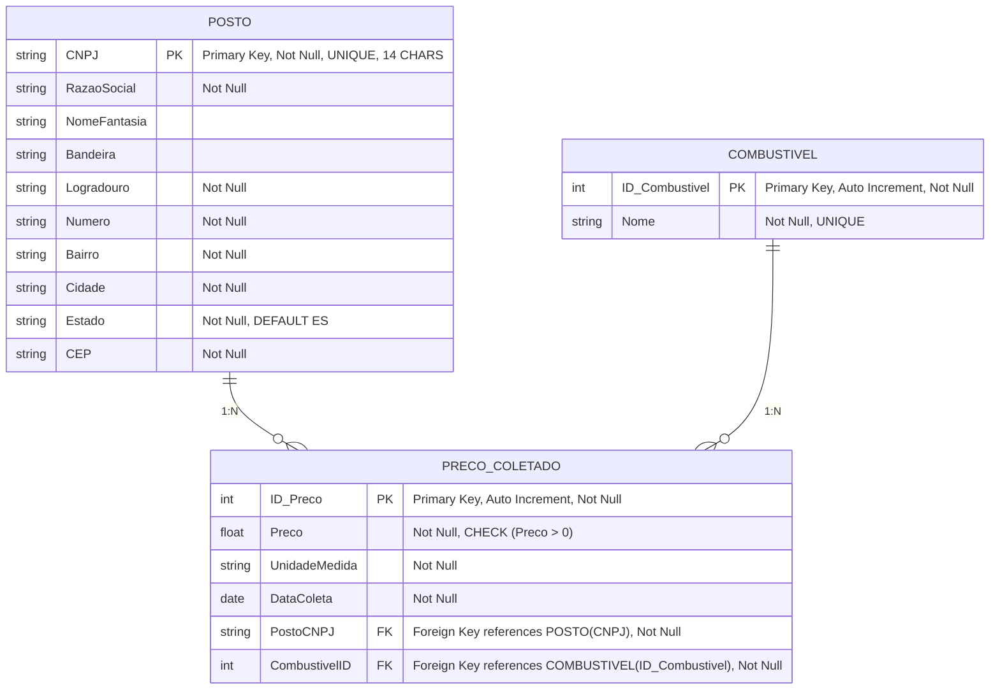

<h1>
Fuel Tracker VV

</h1>

:fuelpump: O Fuel Tracker VV é uma aplicação que permite aos capixabas a consulta dos valores de combustíveis registrados pela ANP – [Agência Nacional do Petróleo, Gás Natural e Biocombustíveis](https://www.gov.br/anp/pt-br) – para todos os postos da cidade de Vila Velha, localizada no estado do Espírito Santo.

<p align="center">

</p>

<h1>
Nossos Objetivos
</h1>

:link: O devido projeto foi idealizado, delineado e desenvolvido com a finalidade de aplicar os conceitos teóricos aprendidos na matéria de Arquitetura de Dados Relacional I, ministrada pelo professor Jairo Lucas de Moraes, da Universidade Vila Velha, e conta como atividade complementar de suma importância para avaliação acadêmica. 

:book: Como ponto de partida para a elaboração da aplicação, buscamos os dados brutos a partir de um corte amostral disponibilizado pela própria ANP no site do governo brasileiro, em [Levantamento de Preços de Combustíveis] (https://www.gov.br/anp/pt-br/assuntos/precos-e-defesa-da-concorrencia/precos/levantamento-de-precos-de-combustiveis-ultimas-semanas-pesquisadas). Extraímos, ao todo, **109 planilhas** com amostras dos valores de combustíveis de todos os postos do Brasil, abrangendo os períodos de *julho de 2022 à setemrbo de 2024*.

:gear: O processo de filtragem e limpeza dos dados obtidos foi realizado sob a utilização de scripts específicos com a linguagem de programação Python dentro do ambiente de desenvolvimento (IDE) Pycharm. Além disso, visando o melhor rendimento do projeto e otimização dos processos, aproveitamos esse momento para criar as primeiras restrições. Clique aqui para conferir detalhadamente como realizamos esse processo.

:open_file_folder: Posteriormente, seguimos com o agrupamento dos dados no SGBD Microsoft SQL Server, o que nos permitiu dar continuidade no desenvolvimento das restrições e regras essenciais para a visualização das informações geradas. Utilizamos da ferramenta Mermaid para desenvolver e conceituar a parte em questão.



<h1>
Etapas do Projeto
</h1>

<p align="center">:fuelpump: Projeto conceitual (AOP-1): 

É a etapa primordial para elencarmos todos os atributos em nosso projeto, desde o esboço do bd até a implementação de regras e construção de um modelo lógico e físico, amplamente funcional para os usuários.</p>

<p align="center">:fuelpump: Projeto Lógico e Funcional (AOP-2):

Conversão do projeto conceitual em um projeto lógico, físico e utilizável, contendo todas as restrições, relacionamentos e chaves primárias e estrangeiras propostos na AOP-1, além da especificação dos índices criados em cada tabela.</p>

<p align="center">:fuelpump: Finalização do projeto (AOP-3):

Apresentação do projeto finalizado através de uma aplicação web e de mídias sociais.</p>

<h1>
Contribuidores
</h1>

<p align="center">Pessoas responsáveis pela aplicação:

<p align="center">

</p> @nicolasaigner, estudante do 2º peíodo de Ciência da Computação. :laptop:</p>

<p align="center">

</p> @elisaharmmer, estudante do 2º peíodo de Sistemas  de Informação :laptop:</p>

<h1>
Apoio & Colaborações
</h1>

<p>
Nós adoraríamos contar com a sua colaboração! Se você tem sugestões, ideias ou quer resolver algum problema, fique à vontade para abrir uma issue ou enviar um pull request. Todos(as) são bem-vindos! 😊

```
1. Faça um fork do projeto;

2. Crie uma nova branch (`git checkout -b feature/nova-funcionalidade`);

3. Envie suas mudanças (`git commit -am 'Adiciona nova funcionalidade'`);

4. Faça o push da branch (`git push origin feature/nova-funcionalidade`);

5. Abra um Pull Request
````

✨ Sinta-se à vontade para nos contatar se precisar de ajuda! ✨
</p>